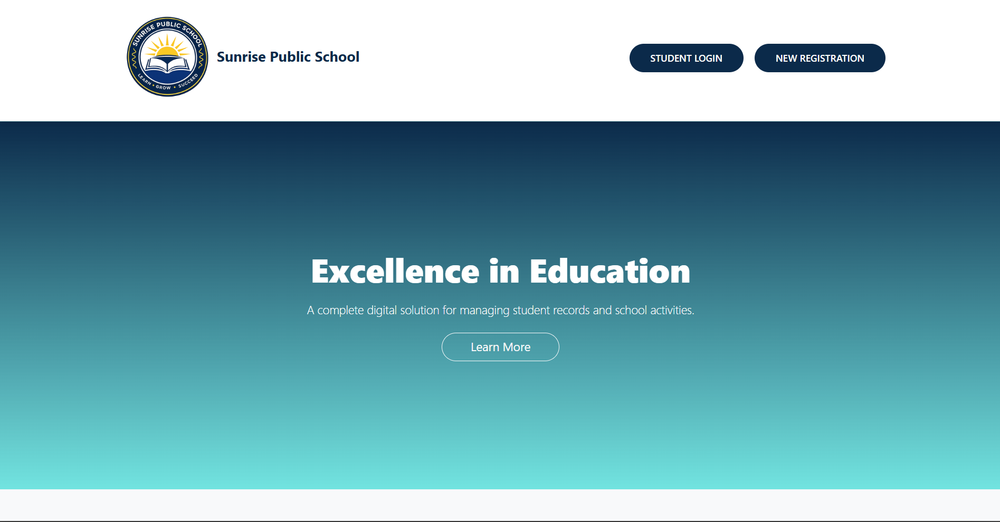
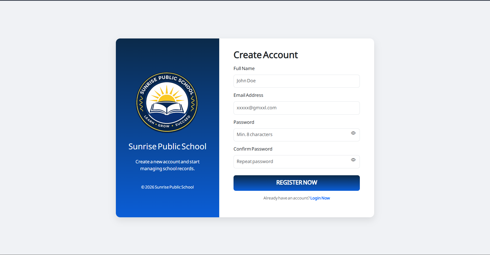
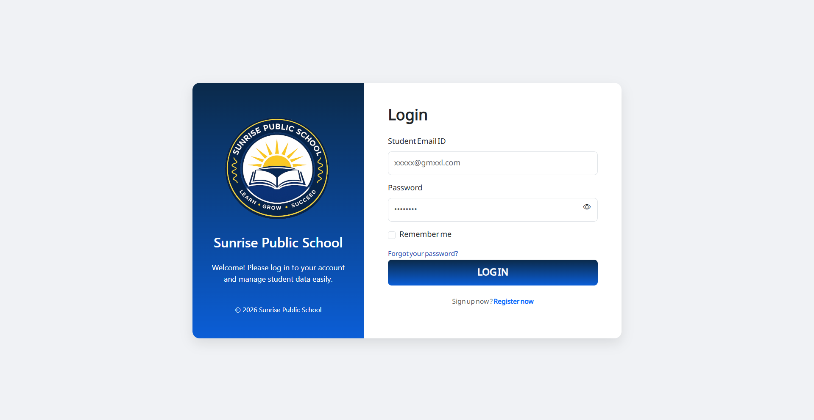
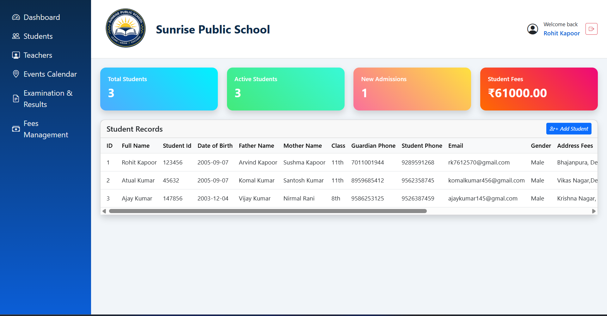
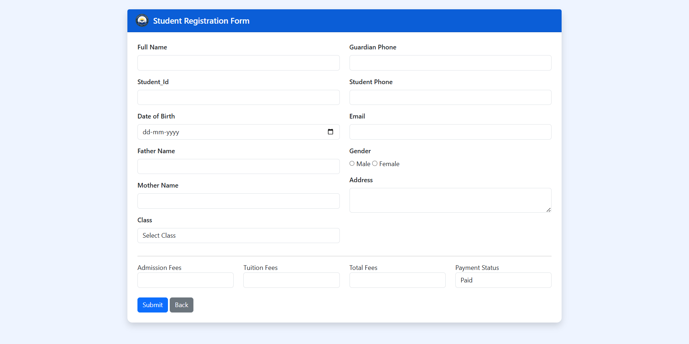
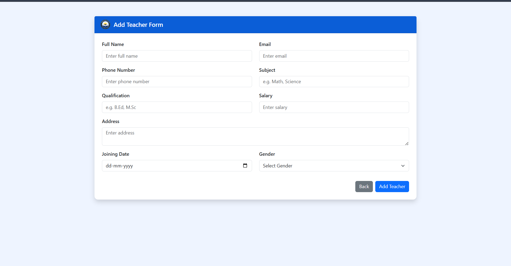
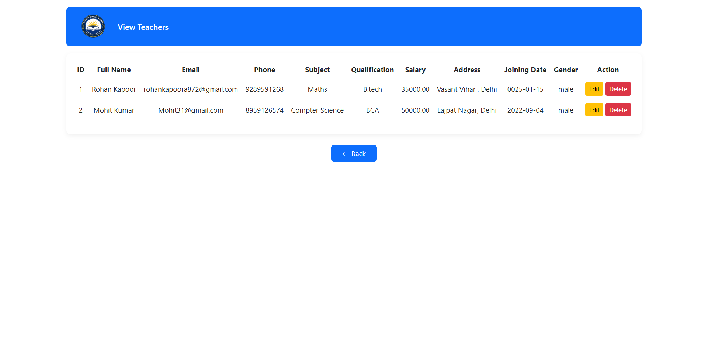
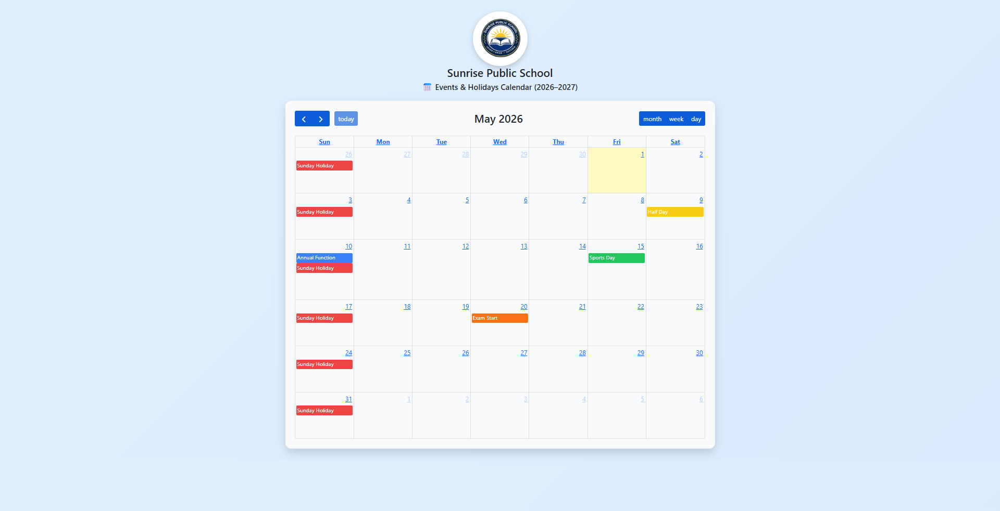
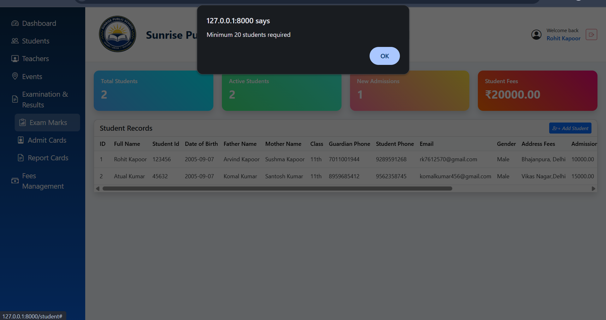
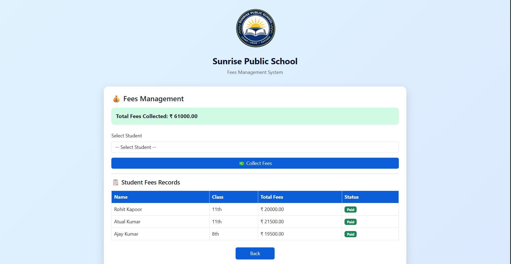

<h1> Student Management Project </h1>

This is project  to mini Student management project. its a examples sunrise public school student register a portal and  submit a basic detail like Full Name and Email id Password. Then After to login a portal Sunrise Public School.

<h2> Tools & Technologies </h2>

The Project utilizes a modern tech stack to ensure scalability and security. Below are the key tools used:

<ul>
    <li>
        Laravel 11 (Backend Framework)
        
Laravel is PHP-based web framework that follows the MVC
        (Model-View-Controller) pattern. It was chosen for its robust
        security features, elegant syntax, and powerful tools like
        “Eloquent” and “Migrations”.

    </li>
    <li>
        MySql (Database).
        
MySql is the most popular open-source relational database. It is
        used in this project to store structured data in tables like ‘Students’,
        ‘teacher’, and ‘users’.

    </li>
    <li>
        Bootstrap 5 (Frontend).
        
Bootstrap is used to design the user interface. It ensured that the
        Student Management System looks professional and works
        perfectly on desktops, Tablets, Mobile phones(Responsiveness’).

    </li>
    <li>
        Eloquent ORM
        
Eloquent is Laravel’s Built-in-tool that allows developers to
        interact with database tables using PHP objects instead of writing
        complex SQL queries.

    </li>
</ul>

    <h2>OUTPUT SEGMENT PROJECT STARTED</h2>
<ul>
    <li>Welcome Page</li>
    <li>Register Page</li>
    <li>Login Page </li>
    <li>Sunrise Public School</li>
    <ul>
        <li>Dashboard.</li>
        <li>Students.</li>
        <li>Teachers.</li>
        <li>Events Calendar.</li>
        <li>Examination & Result.</li>
        <li>Fees Management.</li>
    </ul>
    <li>Logout.</li>
</ul>

 

<h1>Welcome Page</h1>    

This is the landing page of the Sunrise Public School Management portal.it
serves as the main interface for users to navigate through the system.
    

<h1> Resgister Page</h1>    

This is User Registration Page of the System. It allows of new
administrators or Staff members to create a secure account by providing
their basic Detail Full Name, Email, and Password.
    

<h1> Login Page</h1>    

The System uses encrypted password validation to verify user identity
before granting access to the dashboard.
    

<h1> Dashboard </h1>    

Sunrise Public School Dashboard
    

<h1> Student Registration Form </h1>    

This is Student Registration Form and Fill Up Details.
    

<h1> Teacher Registration Form.</h1>    

This is Student Registration Form and Fill Up Details.
    

<h1> View Teachers  </h1>    

This page allows you to view teacher records and edit their details.
    

<h1> Events Calendar. </h1>    

This page displays scheduled event and academic holidays.
    

<h1> Examination & Results. </h1>    

This module displays examination schedules and student results
must be 20 Students active then show results.
    

<h1> Fees Management </h1>    

This Module Manages Student fees records.
    

